

# 해달 입부테스트 git 가이드

해당 가이드는 Visual Studio Code의 `git graph` extension을 사용하고 있습니다.

git, Visual Studio Code(이하 VSC), VSC의 `git graph` extension을 설치하신 뒤 따라오시기 바랍니다.

google에 **VSC github 연동** 과 같은 키워드로 검색하시면 참고할 수 있는 웹페이지를 확인하실 수 있습니다.
[해당 링크](https://github.com/KNU-HAEDAL/bootcamp_division_homework/blob/main/docs/guide.md#3-git-%EC%84%A4%EC%B9%98)에서도 설치에 대한 자세한 설명이 있으니 참고하시기 바랍니다.

# 1. github Fork

1. `fork` 버튼을 클릭합니다.

   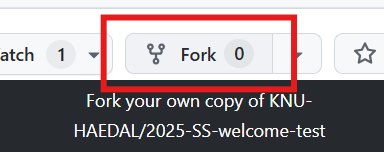

1. `create fork` 버튼을 클릭합니다.

   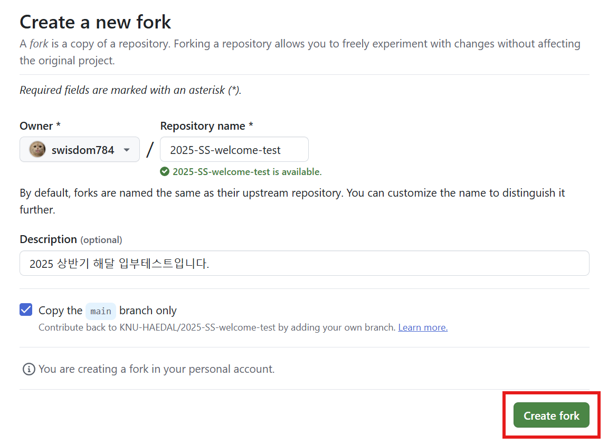

1. fork가 잘 되었는지 확인합니다.

   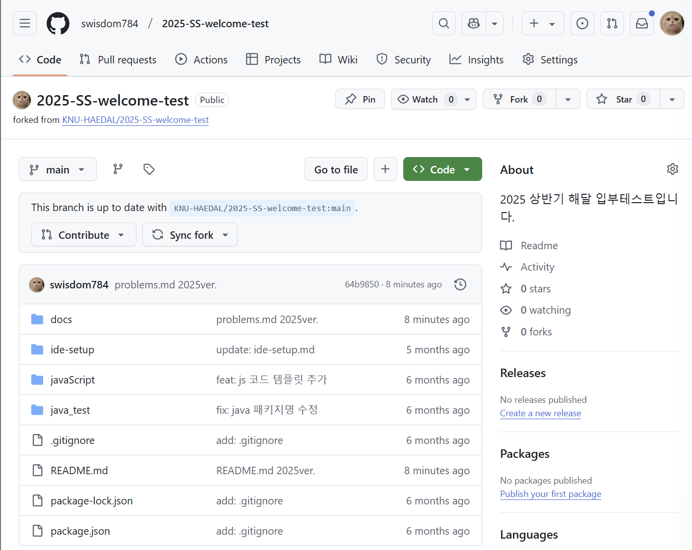

# 2. git clone

1. VSCode를 열면 `Clone Repository`를 클릭한 뒤 `Clone from GitHub`를 클릭합니다.

   

1. `Allow`를 클릭합니다.

   

1. `Authroize Visual-Studio-Code` 버튼을 클릭합니다.

   

1. fork한 `2025-SS-welcome-test` repository를 선택합니다.

   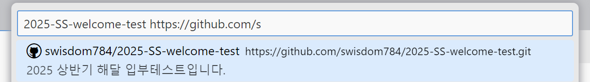

1. 원하는 경로로 clone합니다.

   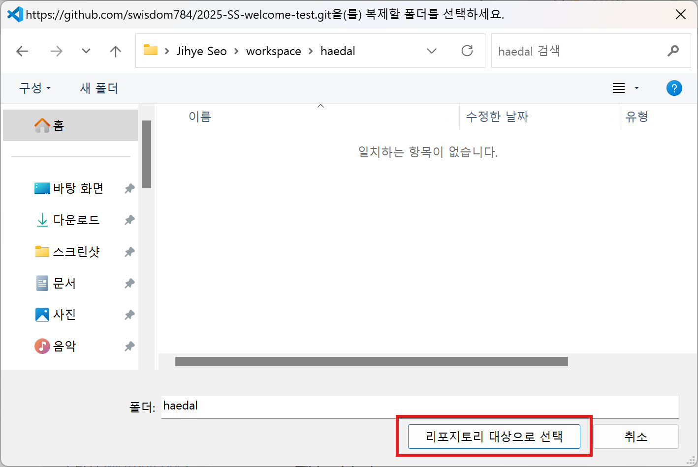

1. `Open` 버튼을 클릭합니다.

   

1. VSCode에 clone한 repository가 열립니다.

   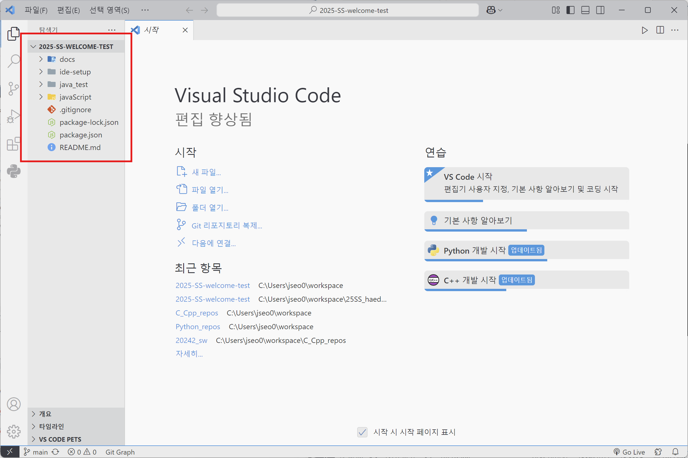

---

# 3. 코드 작성 후 git push

1. 코드를 작성한 후, 본인이 작성한 언어의 채점 프로그램을 실행합니다.
   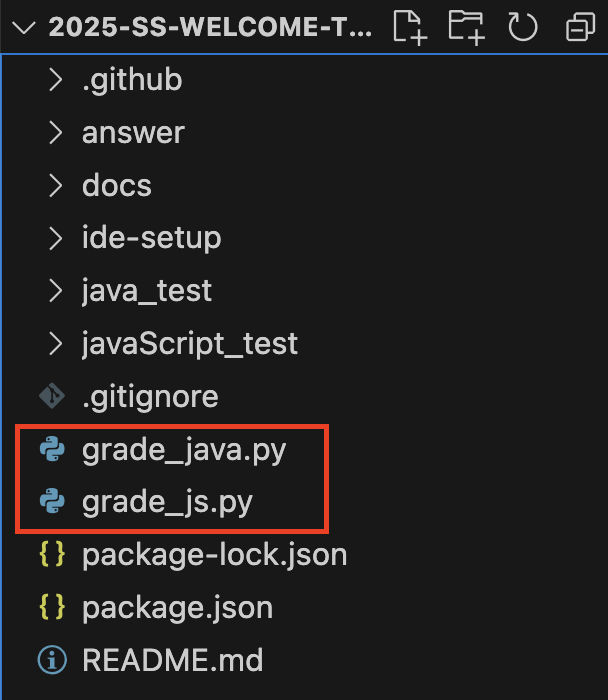
   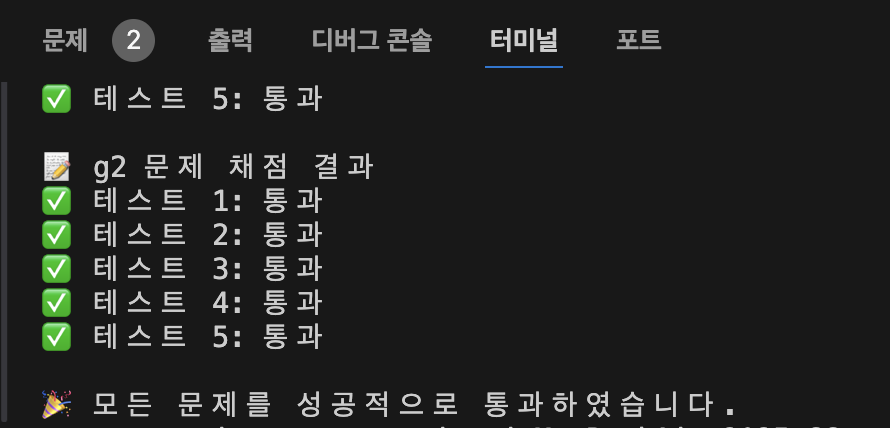

1. 성공적으로 통과됐다면 `git graph(소스제어)` 탭을 들어갑니다.
1. 변경 사항에 마우스를 올려, `모든 변경 내용 스테이징` 버튼을 클릭합니다.
1. `커밋 메세지`를 입력합니다. 내용은 무엇이든 괜찮습니다. *ex) 입부테스트 문제 풀이*
1. `커밋` 버튼을 클릭합니다.

   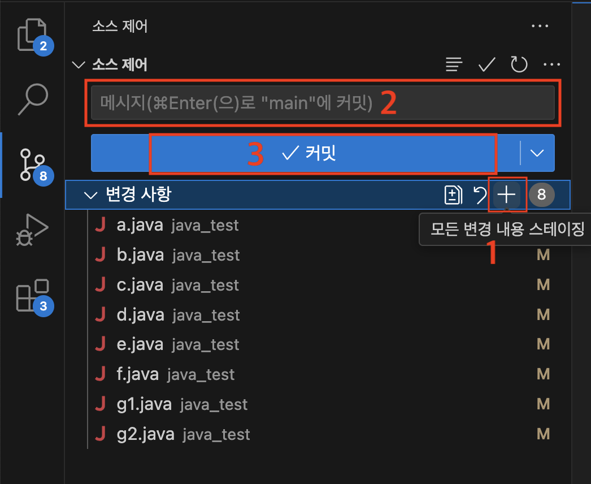

1. `커밋` 버튼 위치에 나타난 `변경 내용 동기화` 버튼을 클릭합니다.

   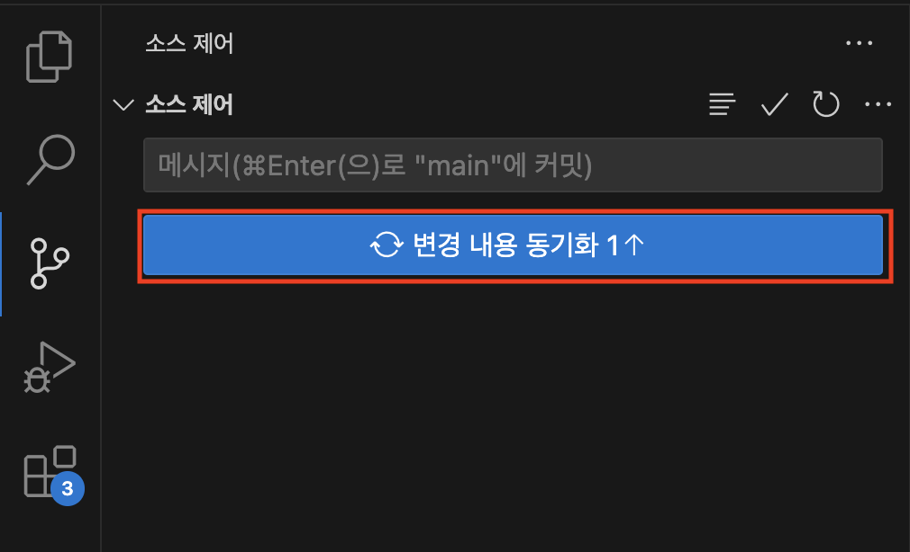

1. 깃허브에 들어가 잘 업로드 되었는지 확인합니다!

   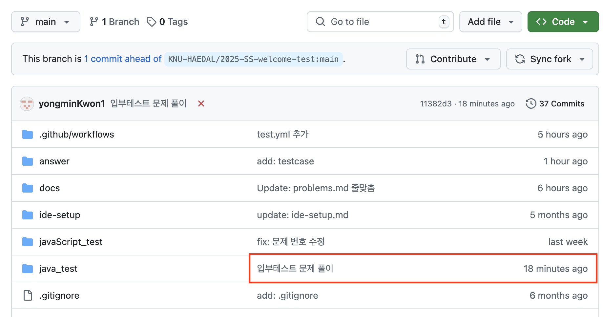

# 4. Pull Request 생성

1. 깃허브 `Pull requests` 탭에 들어가 `New pull request` 버튼을 클릭합니다.
    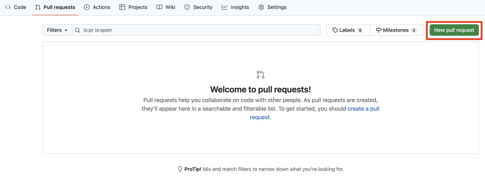

1. `Create pull request` 버튼을 차례로 클릭하면 제출 완료입니다!
    
    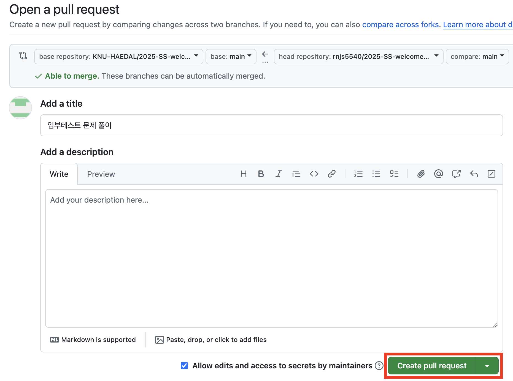
