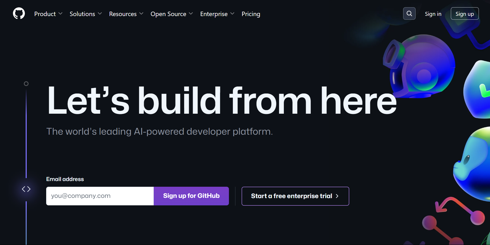

<div align="center">

# 개발 환경 설정 가이드

</div>

ⓒ 2024. 해달/ 해구르르

부트캠프 수업 시작 전, 다음 표를 확인하여 해당되는 사항은 미리 세팅해주세요!

<div align="center">

|                                                     |  C  | python | 웹 기초 | Spring | React |
| :-------------------------------------------------: | :-: | :----: | :-----: | :----: | :---: |
|        [github 계정 생성](#Github-계정-생성)        |  O  |   O    |    O    |   O    |   O   |
|                [Git 설치](#git-설치)                |  O  |   O    |    O    |   O    |   O   |
| [Visual Studio Code 설치](#visual-studio-code-설치) |  O  |   O    |    O    |   X    |   O   |
|              [minGW 설치](#mingw-설치)              |  O  |   X    |    X    |   X    |   X   |
|             [python 설치](#python-설치)             |  X  |   O    |    X    |   X    |   X   |
|      [VSC extension 설정](#vsc-extension-설정)      |  O  |   O    |    O    |   X    |   O   |

</div>

# Github 계정 생성

1. [Github 홈페이지](https://github.com/)에 접속하여 회원가입을 진행합니다.

> **username**은 추후 변경이 불가능하니, 참고해주세요
>
> 이메일 인증까지 해주셔야 가입이 완료됩니다.



# Git 설치

## [Git](https://git-scm.com/)

1. [Git](https://git-scm.com/) 페이지에서 `Download for XXX` 버튼을 클릭합니다.

   

1. 별도 설정없이 `next`를 눌러 설치하면 됩니다.

# Visual Studio Code 설치

## [Visual Studio Code](https://code.visualstudio.com/)

1. `VSCode` 사이트에 접속해서 다운받습니다.
   자신의 운영체제에 맞는 옵션을 `Stable 버전`으로 다운로드 하면 됩니다.

   (Insiders 버전은 최신 버전이지만 불안정하여 여러 버그가 나타날 수 있습니다.
   Stable은 버그 발생률을 줄인 버전으로, Stable로 다운로드 해주시면 됩니다.)

   

### 🪟 Windows ver.

1. 다운로드한 **설치 파일**을 더블클릭하여 **실행**시킵니다.

   

2. **약관에 동의**하고, `다음` 버튼을 클릭합니다.

   

3. 파일이 **설치될 위치를 선택**한 후 `다음` 버튼을 클릭합니다.

   

4. 시작 메뉴에 폴더를 만들거나 기존의 시작 메뉴 폴더를 선택합니다.

   선택하지 않는 경우 **자동으로 Visual Studio Code폴더를 생성**하여 프로그램 바로가기가 생성됩니다.

   

5. 필요한 추가 작업을 선택합니다.

   3, 4번은 기본으로 체크되어 있으니 **체크를 풀지 마시고** 다음 버튼을 클릭하는 것을 추천드립니다.

   

6. `설치` 버튼을 클릭하여 완료합니다.

   

### 🍎 macOS Ver.

1. 다운로드를 완료하면 `(1)`과 같은 파일이 보입니다.

   `(1)`을 더블 클릭 해주면 압축이 해제되며 `(2)`가 생성됩니다.

   

2. `(2)`를 더블클릭하면 아래와 같은 창이 뜨며 VS Code를 이용할 수 있습니다.

   

# MinGW 설치

## [GCC](https://sourceforge.net/projects/mingw/)

### 🪟 Windows ver.

1. [MinGW](https://sourceforge.net/projects/mingw/) 사이트 접속 후 `Download` 버튼을 클릭합니다.

   

1. `Install` - `Continue` 버튼을 클릭합니다.

   

   

   

1. MinGW 설치가 끝나면 아래와 같이 체크한 뒤 `Installation` - `Apply Changes` 를 클릭합니다.

   - mingw-developer-toolkit
   - mingw32-base
   - mingw32-gcc-g++
   - msys-base

   

1. `Apply` 버튼을 클릭해 설치합니다.

   

1. `시스템 환경 변수 편집`을 검색해줍니다.

   > [!WARNING]
   >
   > 띄어쓰기에 주의해주세요.

   

1. `환경 변수(N)...` 버튼을 클릭합니다.

   

1. 시스템 변수에서 변수 `Path`를 찾아 클릭한 뒤, `편집` 버튼을 클릭합니다.

   

1. `새로 만들기` 버튼을 클릭해 아래 2개의 값을 추가해줍니다.

   ```
   C:\MinGW\bin
   C:\MinGW\msys\1.0\bin
   ```

   

1. 확인을 눌러 저장한 뒤, `git bash`를 열어 아래의 명령어를 입력해봅니다.

   ```bash
   gcc -v
   ```

   

   사진과 비슷하게 뜬다면 성공입니다.

### 🍎 macOS Ver.

1. `Terminal`에 아래의 명령어를 입력합니다.

   ```
   xcode-select --install
   ```

# Python 설치

## [Python](https://www.python.org/)

1. [Python](https://www.python.org/) 페이지에서 `Downloads` - `Python XXX` 버튼을 클릭합니다.

   > 2024년 2월 27일 기준
   >
   > 현재 최신 버전은 3.12.2 입니다. 버전은 언제든지 바뀔 수 있습니다.

   

1. `Add python.exe to PATH`를 꼭 체크한 뒤, `Install Now`를 클릭합니다.

   

# VSC Extension 설정

Extension 이름과 제공자를 확인하고 설치하세요.

| 이름        | 제공자    |
| ----------- | --------- |
| Code Runner | Jun Han   |
| Git Graph   | mhutchie  |
| C/C++       | Microsoft |
| Python      | Microsoft |

### 1. Code Runner

1. `Extension` 탭에서 `Code Runner`를 설치합니다.

   

### 2. Git Graph

1. `Extension` 탭에서 `Git Graph`를 설치합니다.

   

### 3-A. (C 사용자) C/C++

1. `Extension` 탭에서 `C/C++`를 설치합니다.

   

### 3-B. (Python 사용자) Python

1. `Extension` 탭에서 `Python`을 설치합니다.

   

### 4. 기본 Terminal 설정 (git bash)

1. `ctrl + shift + p` 입력한 뒤, `terminal default`를 입력하면 아래와 같이 뜹니다.

   ```
   Terminal: Select Default Profile
   ```

   

1. `git bash`로 설정합니다.

   

### 5. Code Runner 설정

1. `Extension` 탭에서 Code Runner 우측 하단 톱니바퀴를 클릭 - `Extension Settings`을 클릭합니다.

   우측 설정창에서 `Run In Terminal`을 찾아 체크합니다.

   

1. 1번과 마찬가지로 `Terminal Root` 를 찾아 `/`를 입력합니다.

   
